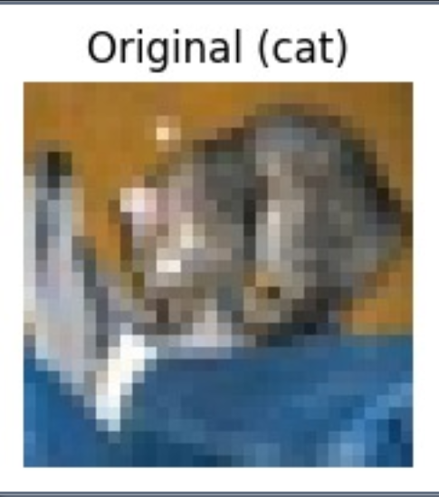
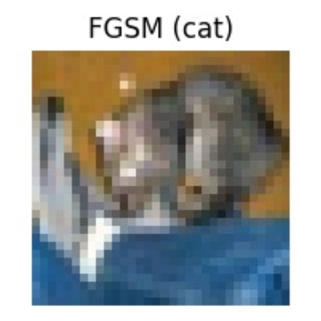
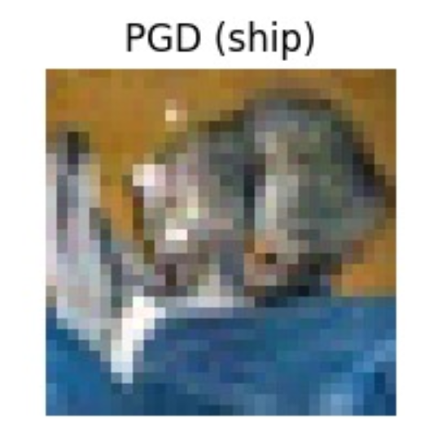
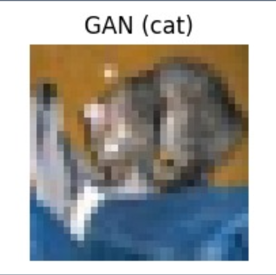
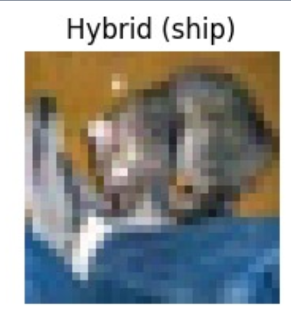

🧠 A Robotics‑Inspired Framework for Evaluating Adversarial Robustness of Deep Image Classification Models

📌 Overview
Deep learning models, especially Convolutional Neural Networks (CNNs), play a critical role in robotic perception systems and autonomous decision‑making.

However, these models are vulnerable to adversarial attacks, where tiny and often invisible perturbations are added to input images to intentionally mislead the model.

This project presents a Robotics‑Inspired Evaluation Framework to analyze how different adversarial attack strategies affect CNN-based image classification systems.

Using the CIFAR‑10 dataset, the framework generates adversarial examples using multiple attack techniques and evaluates their impact on model performance.

🎯 Objectives
• Study vulnerabilities of CNN models to adversarial attacks
• Implement multiple adversarial attack techniques
• Evaluate robustness using quantitative metrics
• Analyze perceptual similarity between original and adversarial images

🗂 Dataset
This project uses the CIFAR‑10 dataset, which contains:

Feature	Description
Total Images	60,000
Image Size	32 × 32
Classes	10
Type	Color images
Classes in CIFAR‑10
Airplane ✈️

Automobile 🚗

Bird 🐦

Cat 🐱

Deer 🦌

Dog 🐶

Frog 🐸

Horse 🐴

Ship 🚢

Truck 🚚

🧠 CNN Model Architecture
A custom Convolutional Neural Network (CNN) is used for classification.

Main components:

Convolutional Layers

ReLU Activation

Max Pooling

Fully Connected Layers

Softmax Output Layer

The model is trained on CIFAR‑10 to achieve high baseline accuracy before adversarial attacks are applied.

⚠️ Adversarial Attack Methods
The project evaluates four adversarial threat models.

1️⃣ Fast Gradient Sign Method (FGSM)
A single‑step gradient-based attack that perturbs the input image in the direction of the loss gradient.

✔ Fast
✔ Simple implementation

2️⃣ Projected Gradient Descent (PGD)
An iterative attack method considered the gold standard for adversarial robustness testing.

Features:

• Multiple gradient updates
• Stronger perturbations than FGSM

3️⃣ GAN‑Based Adversarial Attack
A Generative Adversarial Network (GAN) is used to generate adversarial samples capable of fooling the classifier.

Advantages:

✔ Realistic adversarial samples
✔ Harder to detect

4️⃣ Hybrid Attack (GAN + PGD)
A combined attack strategy that merges:

• GAN‑generated perturbations
• PGD optimization

This produces high‑potency adversarial examples that significantly reduce model accuracy.

🤖 Robotics‑Inspired System Pipeline
The framework includes a perception validation step similar to robotic systems.

Pipeline:

Input Image
     ↓
CNN Prediction
     ↓
Correct Prediction Validation
     ↓
Apply Adversarial Attack
     ↓
Re‑evaluate Prediction
This ensures that only initially correct predictions are attacked, allowing accurate evaluation of adversarial robustness.

📊 Evaluation Metrics
The following metrics are used to evaluate attack performance.

Metric	Description
Attack Success Rate (ASR)	Percentage of adversarial samples that cause misclassification
Accuracy Drop	Reduction in model accuracy after attack
SSIM	Structural Similarity Index between original and adversarial images
SSIM ensures perturbations remain imperceptible to humans.

🖼 Example Results
Original vs Adversarial Images

Example:

Additional attack results for FGSM, PGD, GAN, and Hybrid models are included in this repository.

🛠 Technologies Used
Python

PyTorch / TensorFlow

NumPy

Matplotlib

CIFAR‑10 Dataset

Deep Learning

Adversarial Machine Learning

🚀 Future Improvements
Implement adversarial defense mechanisms

Test robustness on larger datasets like ImageNet

Deploy framework in robotic perception systems

Build real‑time adversarial detection systems

👩‍💻 Author
Naga Hasmitha
B.Tech – Computer Science and Engineering (Artificial Intelligence)
Amrita Vishwa Vidyapeetham
